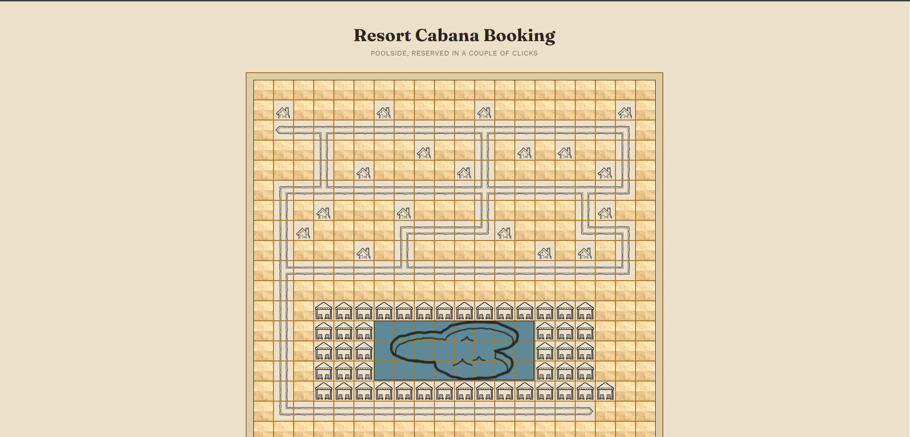
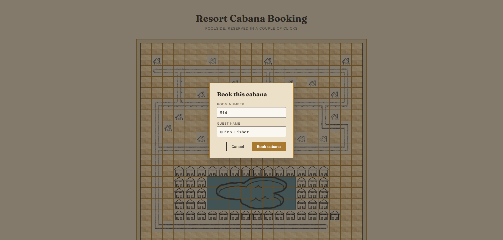
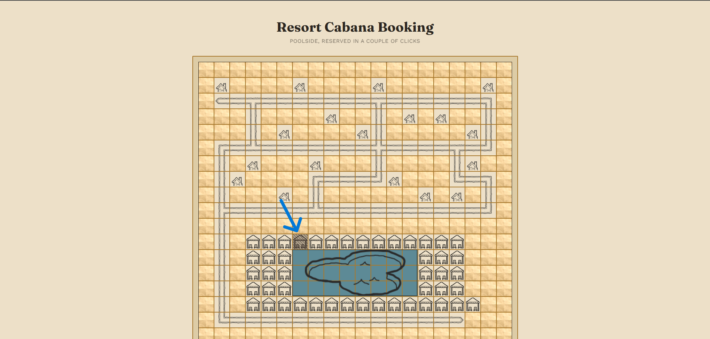

# Resort Cabana Booking

An interactive resort map where guests can browse poolside cabanas and book one in a couple of clicks. Built for the Journey Travel take-home assessment.



## What it does

- Renders the resort map (pool, cabanas, chalets, paths) from an ASCII layout file
- Lets a guest click any available cabana to open a booking form right on the spot
- Books a cabana in just two clicks: click the cabana, then click submit with your room number and name filled in
- Validates the booking against a guest list, so only a matching room and name combination goes through
- Updates the map immediately so a booked cabana is visibly different from an available one





## Stack

- **Backend:** Node.js, Express, plain JavaScript
- **Frontend:** React, TypeScript, Vite
- **Testing:** Vitest in both workspaces, Supertest for API integration tests, React Testing Library for components

The backend is plain JavaScript and the frontend is TypeScript. More on why in the design notes below.

## Running it

### Requirements

- Node.js 18+
- npm

(`npm install` may print a moderate advisory for a transitive, dev-server-only esbuild/Vite dependency; it doesn't affect the app itself and isn't addressed here.)

### Start

```bash
./run.sh --map ./map.ascii --bookings ./bookings.json
```

On a fresh clone, this installs dependencies for both the backend and frontend automatically before starting them, so it's genuinely one command from checkout to a running app. On later runs it skips straight to starting both services.

This starts the backend on `http://localhost:3001` and the frontend on `http://localhost:5173`. Open the frontend URL in your browser.

Both flags are optional. Leaving them out falls back to `map.ascii` and `bookings.json` resolved relative to the current working directory the backend process is started from — `run.sh` always resolves this to the project root, which is why the defaults work as expected when starting the app through it.

### Running the two halves manually (if you'd rather not use the script)

```bash
npm install --workspaces

# terminal 1
cd server
node src/index.js --map ../map.ascii --bookings ../bookings.json

# terminal 2
cd client
npm run dev
```

## Using the app

1. The map loads on screen: pool in the middle, cabanas around it, chalets and paths filling out the rest of the grounds.
2. Click any cabana. If it's free, a small form pops up asking for a room number and guest name.
3. Submit it. If the room and name match an actual guest, you'll see a confirmation and the cabana updates on the map right away.
4. If someone's already booked that cabana, clicking it just tells you it's taken instead of opening the form.
5. Get the room or name wrong and you'll get a short error instead of a silent failure.

There's no login. Knowing your own room number and name is treated as enough to book.

## How the map is built

The map comes in as a plain text grid (`map.ascii`), one character per tile:

| Character | Meaning |
|---|---|
| `W` | Cabana |
| `p` | Pool |
| `#` | Path |
| `c` | Chalet |
| `.` | Empty ground |

The backend reads this file once at startup and turns it into a structured object: a 2D array of typed tiles, plus a flat list of cabanas with stable IDs. The frontend never reads the raw ASCII itself. It only ever sees the parsed JSON coming back from `GET /api/map`, which keeps map-reading logic in one place.

A few things worth explaining about how specific tiles get built:

**Cabana IDs.** Each `W` becomes a cabana with an ID like `cabana-r11-c3`, built from its row and column in the grid. This makes IDs deterministic and unique without needing a separate counter or database, and both the backend and frontend always agree on the same ID for the same tile.

**Path tiles are auto-oriented, not static.** The provided assets for `#` (straight run, corner, dead end, T-junction, crossing) are directional line art, not a single generic path tile. So for every `#` in the grid, the parser checks its four neighbors (up, down, left, right) to see which of them are also `#`, counts how many are open, and picks the matching asset and rotation:

- 0 or 1 open neighbor: dead end
- 2 open neighbors, opposite sides: straight run
- 2 open neighbors, adjacent sides: corner
- 3 open neighbors: T-junction
- 4 open neighbors: crossing

This is computed fresh from the grid every time the map is parsed, so it isn't tied to this specific layout. Swap in a different `map.ascii` and the paths still render with the correct shape and orientation for whatever corridors that map actually has.

**The pool renders as one image, not per-tile tiles.** Rather than repeating a water texture across every `p` cell, the backend scans the grid for all `p` tiles and computes a bounding box (top-left row and column, plus how many rows and columns it spans). The frontend places a single `pool.png` over that exact area. This is computed from the actual map data too, so it isn't hardcoded to the size or position of the pool in the example file.

## Running tests

```bash
# backend
cd server
npm test

# frontend
cd client
npm test
```

Backend tests cover the ASCII map parser (including the path direction logic and pool bounding box), the booking validation rules, and the two API routes end to end. Frontend tests cover the map rendering and the booking modal's success and error paths, with the API calls mocked out so nothing hits a real network request.

## What each part of the backend does

- **`services/mapParser.js`**: turns the raw ASCII file into the structured map object described above. Pure logic, no HTTP or file system code beyond reading the input string.
- **`services/bookingService.js`**: holds the in-memory list of cabanas and the guest directory loaded from `bookings.json`, and owns all the booking validation rules (see assumptions below).
- **`routes/mapRoutes.js`** and **`routes/bookingRoutes.js`**: thin Express handlers. They don't contain business logic themselves, they just call into the services above and shape the HTTP response.
- **`middleware/errorHandler.js`**: catches anything unhandled and returns a generic error response instead of leaking a stack trace.

Keeping logic in services and routes thin means the parsing and booking rules can be tested directly, without spinning up a server, which is what the backend test suite does.

## Assumptions made along the way

A few decisions weren't spelled out in the brief, so here's what was assumed and why:

- **`bookings.json` is a guest directory, not a booking record.** It only lists room numbers and names, with nothing about which cabana anyone has. So every cabana starts as available, and the backend is the source of truth for who's booked what, for as long as the process stays running.
- **One active booking per guest.** The brief doesn't say whether a guest can book more than one cabana. Letting a single room and name book the entire map felt like the wrong default, so once a room and name combination has an active booking, further attempts by that same guest are rejected until the server restarts.
- **Validation requires both room number and name to match the same guest record.** A correct room with the wrong name, or a correct name with the wrong room, is treated the same as both being wrong.
- **The pool is assumed to be a single rectangular block.** The bounding box logic finds the smallest rectangle containing all `p` tiles. An irregularly shaped pool, or a map with more than one pool, would need a different approach than what's built here.

## Design decisions and trade-offs

**Backend in plain JavaScript, frontend in TypeScript.** The backend is small enough (one parser, one booking service, two routes) that types didn't add much beyond documentation, which JSDoc comments cover well enough. The frontend is where TypeScript earns its place: catching a mismatch between what the API returns and what a component expects is exactly the kind of bug types are good at preventing. It's a bit of a departure from a single-language codebase, but a deliberate one, not an inconsistency.

**Kept out of scope:** authentication of any kind, persistent storage, and handling multi-shaped or multiple pools on the same map. All reasonable follow-ups if this went further, but not needed for what was asked here.

## Project structure

```
/server
  src/
    models/       # data shapes, documented via JSDoc
    services/     # map parsing, booking logic
    routes/       # thin Express route handlers
    middleware/   # error handling
  tests/
    services/
    routes/

/client
  src/
    components/   # ResortMap, MapTile, BookingModal
    hooks/        # useResortMap
    api/          # fetch wrapper for the backend API
    types/        # TypeScript types matching the API response shape
  tests/
    components/

run.sh              # single entrypoint, installs dependencies on first run
                    # and starts both halves together
map.ascii           # example map
bookings.json       # example guest list
```